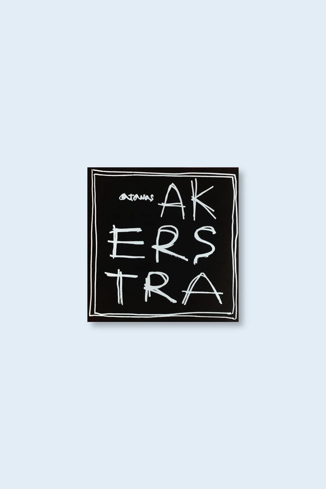

date: 2025-07-01
tags: release
permalink: /release/heg03/
---

home

atanas akerstra "vol.1" (heg03) - july 2022

Cosmic proto-blues. Atanas Akerstra is the solo project of Rogelio Astigarraga.

     Roge has been a core member of the ever-changing and hugely influential experimental/industrial rock band Akauzazte, from Azkoitia, for over three decades. Located in the mountains of the Urola river valley at the heart of the Basque Country, Azkoitia has an old slaughterhouse that was turned in 1996 into a self-managed building used as an art/performance space, theatre, cinema, live music venue, and recording studio. Environment and heritage are essential to understanding Roge and Akauzazte's musical output as journalist Antton Iturbe suggests:

     "Isolated and at the same time deeply rooted to their land, they amplify their heartbeats in order to dance to the beats produced by empty bones and rusty hammers. The waste materials of the old slaughterhouse are now musical instruments. […] They are open to surprise and attentive to their inner voice in order to act like mediums of a collective trance.”

     The aforementioned definition of Akauzazte may also, from a slightly different scope, apply to Atanas Akerstra. In both cases, it’s all about the transmutation of very primary elements and feelings into deep listener’s enlightenment; and in the middle of this transformation process there’s the music acting as the medium. This binomial phenomenon is always present in the music of Atanas Akerstra in different forms: sky and roots, mud and heaven, up and down, roughness and refinement…

     Roge released Vol.1 back in 2006, compiling music composed during 1991–2016. It was published by Iñigo Ugarteburu on his own Talo Recordings label as handmade CDs and a limited run of 125 LPs in handmade covers. Now reissued with the original artwork.

<iframe seamless="" src="https://bandcamp.com/EmbeddedPlayer/album=3148008875/size=large/bgcol=ffffff/linkcol=0687f5/tracklist=false/artwork=small/transparent=true/" style="border: 0; width: 400px; height: 120px;">
<a href="https://hegoadiskak.bandcamp.com/album/atanas-akerstra-vol-1">
      Atanas Akerstra Vol. 1 de Hegoa
     </a>
</iframe>

Atanas Akerstra Vol. 1 de Hegoa
