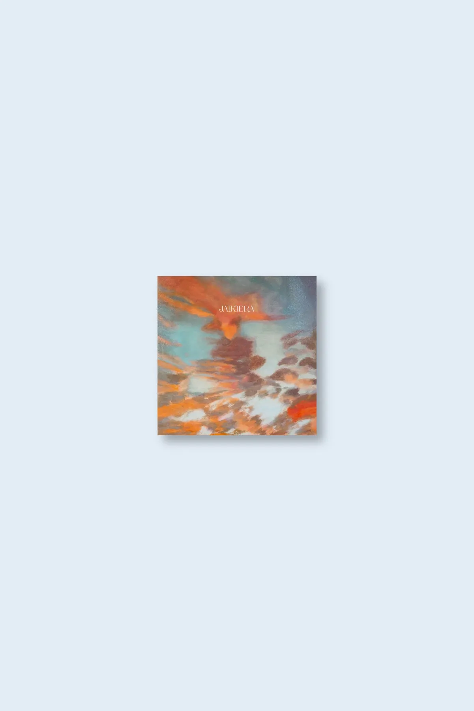

home

verde prato "jaikiera" (heg04) - may 2022

“Jaikiera” by Verde Prato recovers Basque oral tradition through modern lenses. Ana Arsuaga’s reverb-soaked drum machines and synths transform traditional folk stories into dreamy, ethereal pop songs. Recorded after her acclaimed debut, this two-song 7" is a haunting continuation of her exploration of Basque heritage.

<iframe seamless="" src="https://bandcamp.com/EmbeddedPlayer/album=4145652701/size=large/bgcol=ffffff/linkcol=0687f5/tracklist=false/artwork=small/transparent=true/" style="border: 0; width: 400px; height: 120px;">
<a href="https://hegoadiskak.bandcamp.com/album/jaikiera">
      Jaikiera de Verde Prato
     </a>
</iframe>

Jaikiera de Verde Prato
