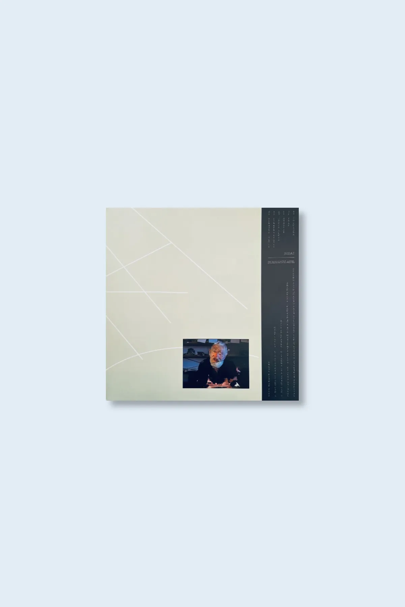

date: 2025-07-01
tags: release
permalink: /release/heg08/
---

home

bidai "biarrezgaur" (heg08) - december 2023

Biarrezgaur (not tomorrow, today) is a blissful and misty set of guitar tones entangled with effects and reverberation. Dreamy and reflective proto-blues-folk sketches that suggest a sense of matured serenity that only comes with years of practice. Spontaneous, gentle and free-flowing in equal parts, Biarrezgaur is a perfect autumnal recipe for those looking in the direction of Six Organs of Admittance, Loren Connors with Alan Licht, or even Robbie Basho or Albert Gimenez if you listen to the closing track Itzulera.

     Bidai (Trip) is the new collaborative project between two emblematic figures of the rich Basque musical heritage, Xabi Strubell & Mikel Vega. It took more than 30 years for their paths to cross, but we are very pleased they finally did in 2022. Entirely improvised with two guitars and effects, it was recorded at Bonberenea, the independent and self-funded cultural hub housed in an abandoned warehouse in Tolosa (in the valley of the river Oria).

     Xabi is a writer, poet and musician from Hondarribia, a fishing village on the border with France. He started his career as a member of Dut, the seminal Post Hardcore band that any Basque kid growing in the 90’s and interested in feedback and distorted guitars will sorely remember, still a cult these days. He formed Zura in 2005, a solo mature project focusing on acoustic guitar.

     Mikel is an accomplished musician and all-around cultural activist from Bilbao. Has collaborated in numerous projects (Conteiner, Killerkume, Loan, Orbain Unit) and more recently with Miguel A. Garcia (also a member of Dopelganger, Heg008) and Joseba Agirrezabalaga (Lepok, Urpa i Musell beginning of 2023).

     Limited edition of 300 black vinyl LP’s housed in a coloured matt laminated cover designed between Xabi Strubell, Mikel Vega & Mikel Acosta.

<iframe seamless="" src="https://bandcamp.com/EmbeddedPlayer/album=1479468834/size=large/bgcol=ffffff/linkcol=0687f5/tracklist=false/artwork=small/transparent=true/" style="border: 0; width: 100%; height: 120px;"><a href="https://hegoadiskak.bandcamp.com/album/biarrezgaur">Biarrezgaur de Bidai</a></iframe>

Biarrezgaur de Bidai
