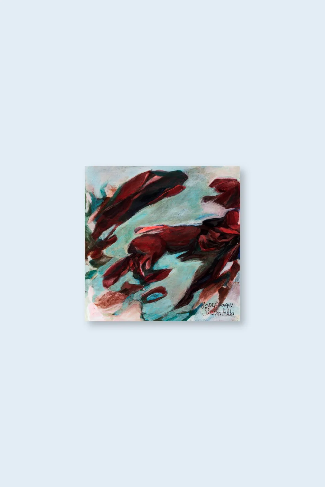

home

dopelganger "sainen hildo" (heg09) - december 2023

Dopelganger is the project in collaboration between classically trained accordion player and singer Garazi Navas (Usansolo, Bizkaia-Biscay, 1995) and Miguel A. Garcia (Vitoria-Gasteiz), an artist living in Bilbao with an extensive career in the fields of experimental music and sound art.

     Sainen Hildo is an album based on Miguel’s original compositions, recomposed and rearranged for accordion and voice by the two composers. Using the natural resonance and harmonics of these two instruments to influence their introspective interactions, resulting in evolving drones and tones and puzzling percussive outbursts. Unusual and at times unsettling, they manage to create a calibrated, deep and complex exploratory universe of ambience and drone where listening becomes a ritual. Highest recommendation for fans of Pauline Oliveros, Eliane Radigue or Phill Niblock.

     Garazi Navas was classically trained at Musikene School of Music in San Sebastian with a masters in traditional music, Garazi, is a restless accordionist who, despite her young age, has taken part in a multitude of projects in theater, poetry, ballet, art installations and even playing with the Bilbao Symphony Orchestra. Her works are a personal interpretation of the close relationship which she feels exists between cutting-edge and traditional music.

     Miguel A. García has performed extensively in Europe, America and Asia, both as a solo artist, improvising and in multiple ensembles. He has collaborated with dozens of artists (Al Karpenter, Jean Luc Guionnet, Sébastien Branche...) in studio and live, and appeared in more than a hundred albums. At the same time, he is organizer and curator of events, being founder of Club Le Larraskito, director of Zarata Fest, and part of the coordination of the cycle Hotsetan at Azkuna Zentroa itself.

     Acrylic painting on heavyweight paper by Maite Mugerza Ronse. Limited edition of 300 black vinyl LP’s housed in a coloured matt laminated cover.

<iframe seamless="" src="https://bandcamp.com/EmbeddedPlayer/album=749646337/size=large/bgcol=ffffff/linkcol=0687f5/tracklist=false/artwork=small/transparent=true/" style="border: 0; width: 400px; height: 120px;">
<a href="https://hegoadiskak.bandcamp.com/album/sainen-hildo">
      Sainen Hildo de Dopelganger
     </a>
</iframe>
