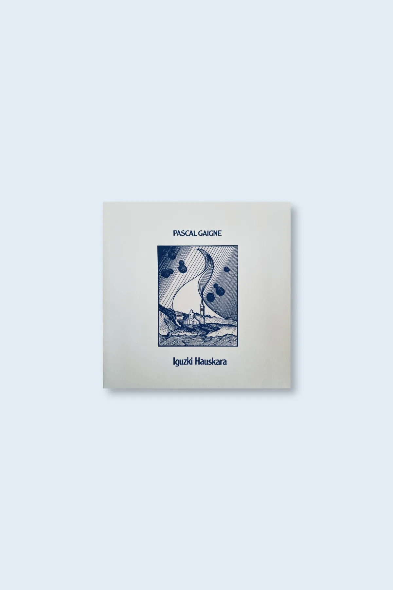

home

pascal gaigne "iguzki hauskar" (heg010) - july 2024

“Iguzki Hauskara by Pascal Gaigne, combines Basque Folk oral tradition, Spanish guitar and Contemporary Classical minimal compositions in equal parts. Beautifully haunting, wondrous and expansive, this record speaks to the spirit. A timeless document that befits situations and sceneries that existed long before this record was made. A pivotal moment in Pascal’s career, highest possible recommendation for fans of 80’s counterpart instrumentalists like Luis Paniagua, Wim Mertens’s Soft Verdict, Albert Gimenez or Pep Llopis”

     Pascal Gaigne, born in France in 1958 and installed in San Sebastian since 1985, is a musician with a vast trajectory composing music for films. He has composed for more than 50 movies, won 16 awards (including a Goya award, Spanish Oscar equivalent) and had 15 nominations. He has worked with some of the most interesting new directors in Spanish cinema (Víctor Erice, Icíar Bolláin, Salvador García Ruíz, Daniel Sánchez Arévalo, Montxo Armendáriz), and foreign directors like France (Le cou de la girafe), Finland (Matka Edeniin) or Cuba (Omerta).

     Early in his career, before working in cinema, he collaborated with some of the most interesting artists and voices in the short history of Basque folk music, including well known Amaia Zubiria (check the two records he made with her “Egun Argi Hartan” & “Kolorez eta Ametsez”), as well as Basque traditional chant avant-gardist Beñat Achiary. It is together with Amaia & Beñat that he paired himself up to create “music pour le ballet du Iguzki Hauskara”, an entire album of compositions made for the 80’s French Basque Ballet group “Ekarle”. Originally released on cassette only in 1984, it is now reissued by Hegoa including three unreleased pieces taken from a second album that was never published.
     Limited edition of 250 black vinyl LP’s housed in a coloured reversed cover recreating the original hand painted artwork.

<iframe seamless="" src="https://bandcamp.com/EmbeddedPlayer/album=3612239364/size=large/bgcol=ffffff/linkcol=0687f5/tracklist=false/artwork=small/transparent=true/" style="border: 0; width: 400px; height: 120px;">
<a href="https://hegoadiskak.bandcamp.com/album/iguzki-hauskara">
      Iguzki Hauskara de Pascal Gaigne
     </a>
</iframe>
