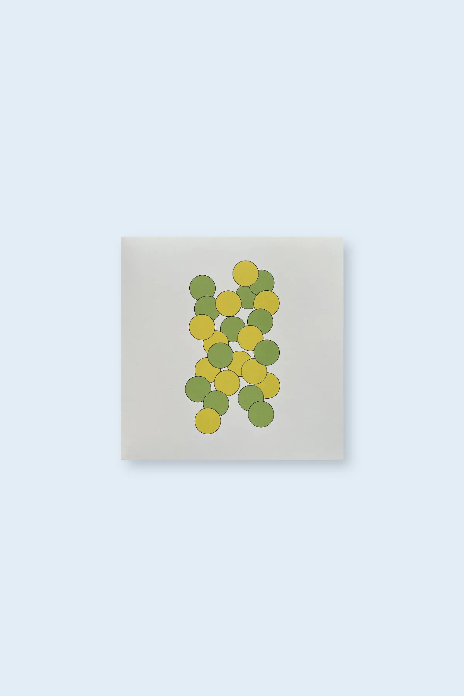

home

iker munduate "argi zantzuak" (heg011) - october 2024

“Heavily influenced by 80's ambient & New Age music from Japan & Spain, (fans of Hiroshi Yoshimura, Finis Africae, Suso Saiz or Fumio Miyashita will feel at ease here) Iker Munduate presents 12 compositions of highly serene & contemplative minimal ambient music. Wind blowing through the trees, raindrops rolling down the windows, the sounds presented on this album are meant to complete the environment you are in. Filled with subtle textures and soothing harmonic content, the music blends into the patterns of day to day life, accompanying us within an already existing familiar landscape. Therefore, it is recommended to listen to this record on speakers allowing it to mix with the sounds already present in our surroundings.”

     Iker Munduate Thusberg is a Basque multi-instrumentalist born and raised in San Sebastian and with strong ties to Mikkeli in Finland, where half of his family are from. A fine arts student at Bilbao’s UPV (Basque university), his interest in sound, art and design has led him to combine all these different disciplines and convey them into his music and his work (LP cover is designed by Iker himself).
     After self-releasing various tapes and EP’s experimenting with minimal approaches to production and composition, “Argi Zantzuak” is Iker’s first solo album, and is a long departure from his previous outlets. Prior, He’s been actively involved running “Azkar Zintak” (punk/emo/hardcore tape label), playing in bands like Tenpera & Comic Sans (both aligned with the same style as the label) as well as taking part in the local Free Jazz/Improv & Noise scene performing as a drummer. Together with being present in the underground scene of San Sebastian (Distopia Mutante, Kontenedora…), He has performed at the international festival of experimental art MEM in Bilbao, and at the conference of video creation and sound experimentation Nokodek, in Hendaye, France.
     Limited edition of 250.

<iframe seamless="" src="https://bandcamp.com/EmbeddedPlayer/album=2427904556/size=large/bgcol=ffffff/linkcol=0687f5/tracklist=false/artwork=small/transparent=true/" style="border: 0; width: 400px; height: 120px;">
<a href="https://hegoadiskak.bandcamp.com/album/argi-zantzuak">
      Argi Zantzuak de Iker Munduate
     </a>
</iframe>

Argi Zantzuak de Iker Munduate