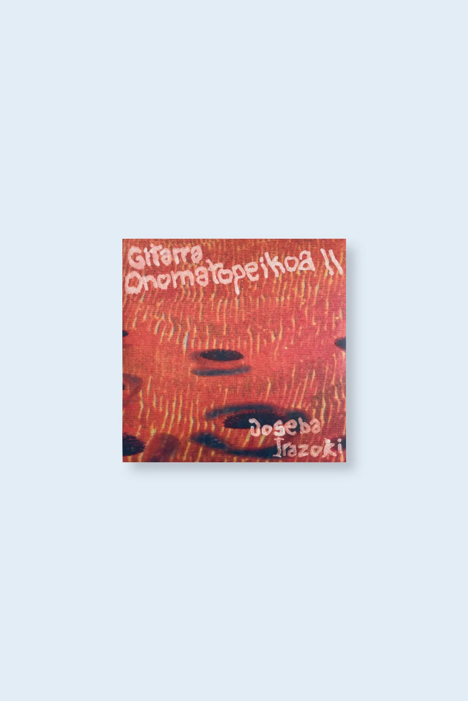

home

joseba irazoki "gitarra onomatopeikoa II" (heg012) - march 2025

“Onomatopeikoa II” follows on from
     Irazoki's 2017 Gitarra Onomatopeikoa
     release, and that album's sense of
     untethered, questing curiosity is not only
     carried over but expanded upon even
     further here. Combining a fully committed
     approach to the guitar with an almost
     egoless lightness of touch, this album
     builds upon the already impressively
     scopious range of Gitarra Onomatopeikoa to dizzying effect.
     Irazoki makes full use of an impressively
     broad palette. Yet nothing feels forced,
     nothing is for show – there’s just a sense
     of open-hearted generosity.
     In lesser hands such a whirlwind tour of
     style and form might risk failing to get
     its hooks in deep enough, yet not only
     does Irazoki have the imaginative scope to
     tackle these varying approaches to the
     instrument, he has the technical chops to
     pull it off. Each composition seems to
     have an openness of intent that is utterly
     disarming; all cards are on the table and
     nothing is held back, resulting in a
     creative tour de force that builds, piece
     by piece, to a unifying cohesiveness that
     makes the whole far greater than the sum
     of its parts.

     Featuring contributions from long-time OTO
     favourites Rhodri Davies and Raphael
     Roginski, “Onomatopeikoa II” is
     nevertheless unmistakably a work of
     singular craft and vision.

     FFO: Jeff Parker, Loren Connors, Keiji
     Haino

     Limited edition vinyl of 250 copies presented by Hegoa with a cover designed by Pablo Mirón.

<iframe seamless="" src="https://bandcamp.com/EmbeddedPlayer/album=2070652195/size=large/bgcol=ffffff/linkcol=0687f5/tracklist=false/artwork=small/transparent=true/" style="border: 0; width: 400px; height: 120px;">
<a href="https://hegoadiskak.bandcamp.com/album/gitarra-onomatopeikoa-ii">
      Gitarra Onomatopeikoa II de Joseba Irazoki
     </a>
</iframe>

Gitarra Onomatopeikoa II de Joseba Irazoki
