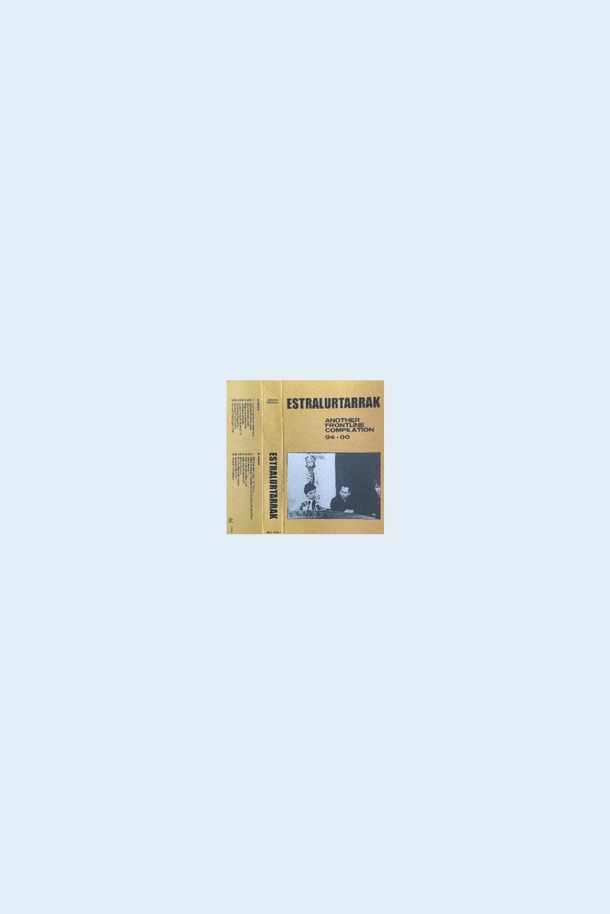

<a href="/" class="home-link">home</a>

estralurtarrak "another frontline compilation" (heg-t01) - october 2021

Estralurtarrak (Extraterrestrials) was a hardcore techno-pop band that emerged in the city of Pamplona in the north of Spain during the 90's.
            At that time, the members mentioned Os resentidos, Pet Shop Boys, Hemendik At! or David Bowie on his Berlin years as their influences.
            Years later, some of their members formed Bigarren Aukera, another almost unknown electropop band that barely had any repercussion. No more information could be found regarding this strange group of Estralurtarrak.

<iframe seamless="" src="https://bandcamp.com/EmbeddedPlayer/album=3942836647/size=large/bgcol=ffffff/linkcol=0687f5/tracklist=false/artwork=small/transparent=true/" style="border: 0; width: 100%; height: 120px;"><a href="https://hegoadiskak.bandcamp.com/album/estralurtarrak-another-frontline-compilation-94-00">Estralurtarrak - Another Frontline Compilation 94/00 de Estralurtarrak</a></iframe>
